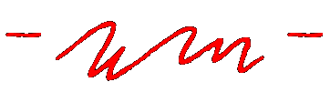

<!-- _coverpage.md -->

<!-- 背景图片-->

  

<!---->

<h1 style="color: #ffffff">自律给我自由<small style="color:#fff;font-family:FeltTipWoman;font-size:20px;font-weight:bold;">WM's log</small></h1>
<!--
wm个人博客
-->

<!-- 自律给我自由 <small>wm</small>-->

<!--<blockquote>
WM's personal log
</blockquote>-->

<ul style="color:#fff">
  <li>每一次、一步、一公里的累计</li>
  <li>都是对自由的执着与期待</li>
</ul>
<!-- [GitHub](#) -->
<!-- [Get Started](base-quickstart.md) -->

  <a href="#/zh-cn/README">
    
  </a>

<!-- 背景色 -->

<!---->

