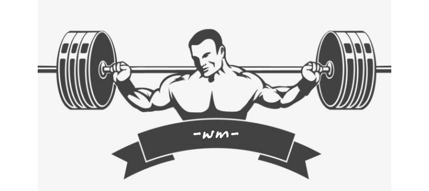

# [运动健身]概览

所谓健身先健脑，先武装大脑再武装身体，本页目的就是学习、收集、整理运动健身理论知识，训练心得，实践总结，安排计划，建立并丰富自己的运动健身理念系统。

（摘）一点建议：

1：多看看书，相对比上网靠谱，不要相信营销扯蛋弱智文

2：运动需要身体感觉，神经控制能力，所有先武装大脑

3：真的了解人体，了解自己，了解运动

4：有足够的知识，才能分辨是非对错，找到答案

5：有时需要交“学费”智商税交够了，也能开发大脑，吃一堑长一智。

## 一、名词解释

本节主要摘录疑问的名词：

- 一、问：健身常说的做多少个时，几rm是啥意思？

  答：健身界“RM”是“Repetition Maximum”的缩写，字面含义是“重复做的最大数值”，意译就是“最大重复次数”，结d合数字x，就实际表示“能够重复练习x次的最大重量”，或“最多只能重复练习x的重量”。

- 二、问：健身器材上的lbs是什么意思？

  答：LB是拉丁语libra的缩写，意思是“磅”，也就是英语的Pound，磅，重量单位，一磅为0.45359237千克(公斤) ，约等于454克。

  lbs是磅的复数形式，5lbs的哑铃就是哑铃的重量为5磅。那么1LB为1磅。

  一般力量器械配重块和哑铃、杠铃、铃片、拉力绳等会以磅为单位。

- HIIT的全名是High-intensity Interval Training。翻译过来就是：高强度！间歇！训练!就是在训练中变换训练强度，使训练强度高低交替进行。例如，冲刺30秒，然后慢跑60秒，再冲刺30秒，然后慢跑60秒……如此重复20分钟左右。

- “RM”是“Repetition Maximum”的缩写，字面含义是“重复做的最大数值”，意译就是“最大重复次数”，结d合数字x，就实际表示“能够重复练习x次的最大重量”，或“最多只能重复练习x的重量”。

## 二、器械训练

​	作为健身房常客，健身爱好者，健身房器械的名称使用是有必要的。

[2.1、健身房器械的简要介绍和使用](/zh-cn/_0001爱好生活/000102运动健身/健身之计划：健身房运动库（器械训练）.md)

## 三、徒手训练

学习收集徒手训练的目的，是不受场地时间的限制进行运动，给运动健身更自由的空间，理论依据是锻炼一块肌肉，锻炼体能，等动作很多，不是非得要蹲健身房，撸器械。

[2.1、徒手训练动作库一](/zh-cn/_0001爱好生活/000102运动健身/健身之计划：健身房运动库（徒手训练）.md)

## 四、运动计划

​	首先就是健身意识的培养——你为什么健身，你想通过健身获得什么，你身体有什么问题需要优先改善，怎么安排自己的健身计划……以上是健身前要定下来的健身大纲。

​	[4.1、2021年度健身计划](/zh-cn/_0001爱好生活/000102运动健身/运动计划-2021年.md)

## 五、励志健身

本节健身效果赏析😋，欣赏锻炼有效果的美图视频等，打鸡血，O(∩_∩)O哈哈~

​	[5.1、励志 健身-阴柔之美](/zh-cn/_0001爱好生活/000102运动健身/健身之计划：励志健身-阴柔之美.md ':title')

​	[5.2、励志健身-阳刚之气](/zh-cn/_0001爱好生活/000102运动健身/健身之计划：励志健身-阳刚之气.md)

​	[5.3、励志 健身-美人标志](/zh-cn/_0001爱好生活/000102运动健身/健身之计划：励志健身-美人标志.md)

## 六、参考资料

> **一、书籍：**
>
> 1.1、运动理论
>
> 《运动解剖学图谱（第3版 顾德明，缪进昌编著）》：[在线查看](/zh-cn/_0001爱好生活/000102运动健身/_ForDownloadFiles/运动解剖学图谱（第3版_顾德明，缪进昌编著）.md)
>
> 1.2、器械训练
>
> 《健美健身运动系统训练（全彩图解第2版）》：[在线查看](/zh-cn/_0001爱好生活/000102运动健身/_ForDownloadFiles/健美健身运动系统训练（全彩图解第2版）.md)
>
> 1.3、徒手训练
>
> 《普拉提解剖学（作者-瑞尔·艾萨考维兹）》：[在线查看](/zh-cn/_0001爱好生活/000102运动健身/_ForDownloadFiles/普拉提解剖学（作者-瑞尔·艾萨考维兹）.md)
>
> 《无器械健身：用自身体重锻练（作者 马克·劳伦）高清》：[在线查看](/zh-cn/_0001爱好生活/000102运动健身/_ForDownloadFiles/无器械健身：用自身体重锻练（作者-马克·劳伦）.md)
>
> 1.4、拉伸
>
> 《拉伸运动系统训练（全彩图解第2版）》：[在线查看](/zh-cn/_0001爱好生活/000102运动健身/_ForDownloadFiles/拉伸运动系统训练（全彩图解第2版）.md)
>
> 《酸痛拉筋解剖书（11种有效缓解颈椎病和腰酸背痛的拉筋操，久坐办公室白领的日常保健必备指南！）》：[在线查看](/zh-cn/_0001爱好生活/000102运动健身/_ForDownloadFiles/酸痛拉筋解剖书.md)
>
> 1.5、运动饮食
>
> 《运动饮食1︰9（作者（日）森拓郎著》：[在线查看](/zh-cn/_0001爱好生活/000102运动健身/_ForDownloadFiles/运动饮食1︰9（作者（日）森拓郎著.md)
>
> **二、网文：**
>
> “健身先健脑”是一个谎言 - 哔哩哔哩
> https://www.bilibili.com/read/cv6644481/
>
> 健身应当遵循的九大原则 - 美篇
> https://www.meipian.cn/jyvg4xz?from=timeline
> http://blog.sina.com.cn/s/blog_5113c62d0101f9x4.html
>
> 为什么总是说健身先健脑，有哪些必须要知道的健身事？
> http://www.360doc.com/content/19/0813/18/49804219_854665732.shtml
>
> tabata和hiit有什么区别
> http://www.360doc.com/content/18/0227/17/21745496_732926627.shtml
>
> Alexia Clark (@alexia_clark) • Instagram photos and videos
> https://www.instagram.com/alexia_clark/channel/
>
> 健康饮食，适当休息，运动损伤。

