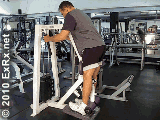
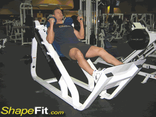
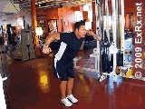
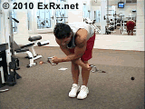
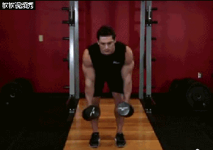

# 健身房通常都有哪些健身器材，及训练动作

## 〇、目录

## 一、有氧区器械

（1）跑步机

（2）椭圆机

（3）卧式健身车

（4）立式健身车

（5）登山机

（6）划船机

（7）动感单车

## 二、力量区器械

### 2.1、力量训练的固定器械部分

#### Ⅰ、臂部训练

##### （1）二头弯举训练器

动作：牧师椅器械弯举

锻炼肌群：肱二头肌

##### （2）臂拖弯举训练器

动作：器械弯举

锻炼肌群：肱二头肌

##### （3）三头下压训练器

动作：器械臂屈伸

锻炼肌群：肱三头肌

#### Ⅱ、肩部训练

##### （1）坐姿推肩器

动作：坐姿推肩

锻炼肌群：三角肌，斜方肌、上胸、肱三头肌

##### （2）肩部平举器

动作：器械侧平举

锻炼肌群：三角肌中束，斜方肌

#### Ⅲ、胸部训练

##### （1）坐姿推胸器

动作：坐姿推胸

锻炼肌群：胸大肌、三角肌前束、肱三头肌

##### （2）蝴蝶夹胸

动作：蝶机夹胸

锻炼肌群：胸沟分离度

##### （3）直臂夹胸

动作（1）：直臂夹胸 

锻炼肌群：胸沟分离度

##### 动作（2）：反式展肩

锻炼肌群：三角肌后束

#### Ⅳ、背部训练

##### （1）高拉背训练器

动作（1）：正握高位下拉

锻炼肌群：背阔肌，大圆肌，小圆肌，棘下肌，三角肌后束，斜方肌， 大小菱形肌

动作（2）：反握器械高位下拉

锻炼肌群：背阔肌，肱二头肌、肩部

##### （2）坐姿划船器

动作：坐姿划船

锻炼肌群：背阔肌，斜方肌

##### （3）T杆划船机

动作：T杆俯身划船

锻炼肌群：背阔肌中部、大圆肌

##### （4）固定坐姿划船器

动作：固定器械划船

锻炼肌群：背阔肌、斜方肌，菱形肌，大圆肌，三角肌后束

##### （5）引体向上助力器

动作：引体向上

锻炼肌群：背阔肌、肱二头肌

#### Ⅴ、腹部训练

##### （1）卷腹机

动作：器械卷腹

锻炼肌群：腹直肌

##### （2）腰腹旋转机

动作：负重体旋转

锻炼肌群：腹外斜肌

##### （3）罗马椅

动作：山羊挺身

锻炼肌群：竖脊肌（腰部训练）

#### Ⅵ、臀部训练

#### Ⅶ、腿部训练

##### （1）股四头训练器

动作：坐姿腿屈伸

锻炼肌群：股四头肌

##### （2）坐姿腿弯举训练器

动作：坐姿腿弯举

锻炼肌群：股二头肌，腘绳肌

##### （3）俯身腿弯举训练器

动作：俯身腿弯举

锻炼肌群：股二头肌，腘绳肌

##### （4）站姿腿弯举训练器

动作：站姿腿弯举

锻炼肌群：股二头肌

##### （5）坐姿髋外展训练器

动作：坐姿髋外展

锻炼肌群：髋外展肌（臀中肌、臀小肌等）

##### （6）坐姿夹腿训练器

动作：坐姿夹腿

锻炼肌群：大腿内收肌群（大收肌、长收肌、短收肌、股薄肌及耻骨肌等）

##### （7）哈克深蹲机

动作：哈克深蹲

锻炼肌群：股四头肌 、股二头肌、臀大肌

##### （8）坐姿蹬腿机

动作：坐姿蹬腿

锻炼肌群：股四头肌、臀大肌

##### （9）站姿小腿训练器

动作：站姿提踵

锻炼肌群：小腿三头肌（腓肠肌、比目鱼肌）

##### （10）坐姿小腿训练器

动作：坐姿提踵

锻炼肌群：小腿三头肌（腓肠肌、比目鱼肌）

#### Ⅷ、综合训练

##### （1）龙门架（大飞鸟）

动作（1）拉力器夹胸

锻炼肌群：胸大肌上部、三角肌前束

动作（2）拉力器前平举

锻炼肌群：三角肌前束

动作（3）拉力器侧平举

锻炼肌群：三角肌中束

动作（4）拉力器俯身平举

锻炼肌群：三角肌后束

动作（5）拉力器屈臂下拉

锻炼肌群：肱三头肌

动作（6）绳索弯举

锻炼肌群：肱二头肌、肱桡肌

动作（7）悬垂举腿

锻炼肌群：腹直肌下部

##### （2）史密斯机

动作（1）史密斯深蹲

锻炼肌群：股四头肌、股二头肌、臀大肌

动作（2）史密斯卧推

锻炼肌群：整块胸大肌、肱三头肌

### 2.2、力量训练的自由器械部分

Ⅰ、臂部训练

Ⅱ、肩部训练

Ⅲ、胸部训练

Ⅳ、背部训练

Ⅴ、腹部训练

Ⅵ、臀部训练

Ⅶ、腿部训练

Ⅷ、综合训练

---

##### （1）平板卧推架

动作：平板卧推

锻炼肌群：整块胸大肌、肱三头肌

##### （2）上斜卧推架

动作：上斜卧推

锻炼肌群：胸大肌的上部及外侧翼上端

##### （3）下斜卧推架

动作：下斜卧推

锻炼肌群：胸大肌下部、外侧翼及下缘沟

##### （4）自由深蹲架

动作：杠铃深蹲

训练肌群：股四头肌、股二头肌、臀大肌

##### （5）哑铃（哑铃可完成动作较多，这里仅举例说明）

动作（1）哑铃上斜卧推

锻炼肌群：胸大肌上部、肱三头肌、三角肌前束

动作（2）哑铃弯举

锻炼肌群：肱二头肌、前臂肌、肱肌、三角肌前部

动作（3）：哑铃俯身双臂划船

锻炼部位：中背部，还会锻炼肱二头肌、肩部

动作（4）：哑铃硬拉

锻炼部位：下背，臀大肌，和股二头肌

动作（5）：哑铃侧平举

锻炼部位：三角肌中束

<video src="健身之计划：健身房运动库（器械训练）.assets/7abac526-23a1-11eb-b42f-2ad3e7667ed4.mp4"></video>

动作（6）：哑铃弯举

锻炼肌群：肱二头肌、前臂肌、肱肌、三角肌前部

##### （6）平板哑铃凳

动作（1）哑铃上斜卧推

锻炼部位：胸大肌中部

动作（2）单臂哑铃划船

锻炼部位：背阔肌、大圆肌

动作（3）哑铃飞鸟

锻炼部位：整块胸大肌的外侧、下缘沟、线条和形态

动作（4）哑铃俯身臂屈伸

锻炼肌群：肱三头肌

##### （7）上斜哑铃凳

动作（1）哑铃上斜卧推

锻炼部位：胸大肌上部

动作（1）俯身哑铃飞鸟

锻炼部位：三角肌后束和上背肌群

##### （8）下斜哑铃凳

动作（1）哑铃下斜卧推

锻炼部位：胸大肌下部

动作（1）

（5.2）哑铃直角凳

动作（1）：哑铃肩上推举

锻炼部位：三角肌前束、三角肌中束、肱三头肌

##### （9）杠铃片（杠铃可完成动作较多，这里仅举例说明）

动作（1）杠铃划船

锻炼肌群：背阔肌，斜方肌，菱形肌，大圆肌、三角肌后束及肘屈肌

动作（1）杠铃硬拉

锻炼部位：股二头肌，臀部肌群、竖脊肌

（10）训练凳

（11）坐姿训练凳

（12）可调式训练凳

（13）奥杆（轴承杆）

（14）普通扣杆（螺母固定）

（15）曲杆

（16）目型杆

（17）六角杠铃

## 三、私教区器械

##### （1）战绳

##### （2）TRX训练带

##### （3）波速球

##### （4）药球

##### （5）瑜伽球

##### （6）按摩球

##### （7）泡沫滚轴

> 参考：
>
> 作者：小象叔叔
> 链接：https://www.zhihu.com/question/21274334
>
>  健身房私教区各种训练道具怎么用？都干嘛的？
>https://www.zhihu.com/question/266532768
> 
> 