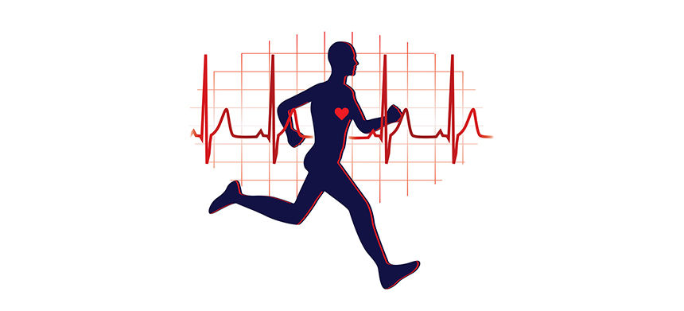
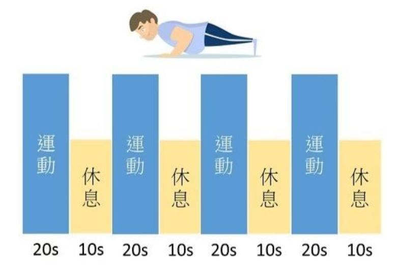

安部位健身：

Ⅰ、臂部训练

Ⅱ、肩部训练

Ⅲ、胸部训练

Ⅳ、背部训练

Ⅴ、腹部训练

Ⅵ、臀部训练

Ⅶ、腿部训练

Ⅷ、综合训练

新手减脂训练选tabata还是HIIT

很久以前我们一直认为有氧运动或许是最好的减脂方法，然而随着hiit的出现，大家开始大力推崇这种高强度的燃脂训练，并成其为“燃脂神器”。而之后日本东京体训大学的田畑泉又发明出了一种叫做tabata间隙训练法，因为tabata只需要4分钟的训练时间，因此被称之为比hiit更高效的减脂训练方法。那究竟hiit和tabata哪个好呢？

如果你没有什么时间运动，但又很想要有效率地燃烧脂肪消耗热量，你会选择高强度间歇训练(High Intensity Interval Training，简称HIIT)还是TABATA间歇训练(Tabata Training)？

等等！这两个训练不是都一样的吗？当然，这两种训练方式基本上都是采用短时间的训练加上短时间的休息，重复循环这个流程，让我们的心率能快速提升到燃脂区间，因此，就能达成所谓的短时间内消耗很多热量，达到减重与减脂的效果。但，他们两个真的一样吗？

hiit和tabata的相同点

hiit和tabata都是高强度的间隙训练，两者都被证实是非常有效的减脂方法，当然除了减脂之外，这两项运动还可以提高人的耐力、速度等方面的表现。

什么是tabata ?

早在1996年，Izumi Tabata博士发表了一项开创性研究，这个研究就成为Tabata训练方法的基础。他最初开始研究短时间高强度运动对运动员的影响，通过与日本奥林匹克竞速滑冰队的主教练Irisawa Koichi合作，实际设计并进行这项训练。最初是在一个自行车功率计（一个带有功率计的固定自行车上测量完成的工作量）上完成的，这种格式是以20秒的高强度运动然后休息10秒，重复进行8轮，总时间为4分钟的训练。Koichi希望Tabata能运用这个训练逻辑分析出这种方法的有效性。

这项实验找来了20岁左右的业余男性运动员并将他们分为两组，第一组在测力计上进行熟悉的稳态训练，保持中等强度VO2 MAX(最大摄氧量)值的70％，这跟我们一般在跑步机上进行慢跑的动作很类似，是一个可以持续时间很久的强度。第二组用VO2 MAX值的170％来进行20秒的运动，接着给予10秒的休息，然后再继续进行20秒VO2 MAX。这个循环重复8次，总时间为4分钟。这里要注意一点，20秒的时间是要尽全力冲刺，如果受测者无法保持这样的速度要求，就将会被要求停止这项实验测试。

这两组受测者经过6周每周5次的训练，第一组中等强度每周运动时间为1小时，第二组高等强度每周运动时间为20分钟。最后研究发现：采用4分钟的Tabata训练与60分钟的中等强度训练对有氧性能的改善，二者竟然具有十分接近的相同效果。除此之外，Tabata这组的无氧能力提高了28％，而中等强度这组并没有得到这样的提升。因此，我们可以知道，Tabata不仅训练时间短得多，而且还提供了两种好处提升。

再简单介绍下。

严格来说tabata应该算是hiit中的一种，tabata的训练非常特殊，全程只需要4分钟的时间，8次循环每次锻炼20秒休息10秒。

如果一个锻炼计划超过了这个时间，那么它就不能算是tabata了。

?> P.S.话虽这么说，但是如今的很多tabata训练法时间都已经超过了4分钟，只不过还是采用这样的循环方式而已。关于这一点我们之前也说过，有研究表明tabata训练法做4分钟差不多可以让身体达到极限，如果你能做很长的时间..那你为什么不增大训练强度呢？

什么是hiit

hiit的全称是高强度有氧间隙训练，和tabata相比，hiit一个很大的区别就在于它在时间上非常的宽泛（不管锻炼时间还是休息时间）。

这也就意味着你在挑选hiit的锻炼动作时选择的余地更大，而tabata就小多了。

很简单的一个例子，比如像深蹲跳、波比跳等燃脂很好的动作光一次反复就需要好几秒的时间，而tabata一个动作的时间只有20秒，如果组合起来那么你完成不了几次反复，自然效果也不会太好。

高强度间歇训练(HIIT)是结合短时间高强度的爆发性运动，在一个15-20分钟短时间的训练中，重复训练与休息的时间。基本上它需要较小的运动时间，通常都是1分钟，再搭配3-5分钟的休息时间。另外，它的最大心率为85-100％之间，而不是中等耐力活动的50-70％。高强度训练就是强度较高且具有爆发力的运动。通过高强度的运动，让身体中的肌肉感受到疲劳，进而开始大量消耗氧气。 此时，高运动强度让身体耗氧量达到最大摄氧量（身体在运动时可以消耗的氧气量最大值）时，会启动一种机制叫做「后燃效应 After-burn Effect」， 简单来说，就是可以让身体在停止运动之后，还继续消耗氧气，因此也能持续消耗热量。

间歇训练就是将训练与休息时间进行交叉设计，例如：动-停-动-停或是高强度-低强度-高强度-低强度，这种训练的好处就是你可以利用不同的运动来进行，例如：短跑、飞轮、跳绳或战绳等等，也能将许多不同的运动及训练方式结合成一套HIIT循环训练。

TABATA≠HIIT？

那TABATA跟HIIT真的不同吗？简单来说，HIIT要求在两轮之间有更多的恢复时间（通常运动时间与休息时间的比例为1：3），就是说当你用高强度运动1分钟后，就能用低强度或中强度运动3分钟，甚至于可以休息3分钟，这都是在容许的范围内。这个比例设计考虑到了人体肌肉在最大努力下的表现方式，以及再次对它们施加最大需求之前充分恢复的持续时间。

但TABATA是采用运动20秒、休息10秒的训练模式来进行，再加上它要求的心率及最大摄氧量(VO2 MAX)要达到170％，对于许多非专业级运动员来说，要达到TABATA的训练效果真的非常不容易。

虽然，这两者有着差异性，但TABATA跟HIIT对于时间不多但又想要快速燃脂与保持肌肉量的人来说，是一种非常好的训练方式。

hiit和tabata哪个好

看完上面的介绍，两者的区别相信已经很明显了，就锻炼效果来说两者无疑都是非常棒的，具体选择哪一个就得看你个人了

如果你时间非常有限，或者你只是一个初学者，那么建议尝试tabata而如果你已经有了一定的基础，想要尝试更多丰富的动作，那么hiit当然是更好的选择啦。

> 4分钟徒手TABATA训练，有效减脂
> https://mp.weixin.qq.com/s?__biz=MzI2MzkwOTE4MQ==&mid=2247485467&idx=1&sn=bbf14cace9401b3d78528c430222e09c&chksm=eab5f249ddc27b5f531ddf0c28215408d76b72b5fb6bfaf00083128dc05932b8f5e591f13f07&scene=21#wechat_redirect
>
> (3 封私信 / 80 条消息) tabata 4分钟真的有效果吗？ - 知乎
> https://www.zhihu.com/question/28248712

> 参考资料：
>
> 梅子健身的个人主页 - 西瓜视频
> https://www.ixigua.com/home/1015565937285708/video/?subtype=played&notea=true